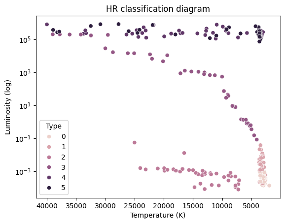
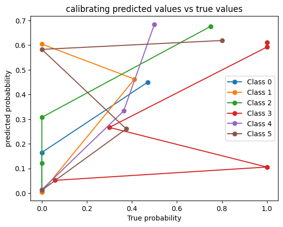

⭐ Star Type Classification

📌 Short Description

This project classifies stars into six categories—Red Dwarf, Brown Dwarf, White Dwarf, Main Sequence, Super Giants, and Hyper Giants—based on physical properties like temperature, luminosity, radius, absolute magnitude, color, and spectral class. It demonstrates a complete ML workflow including data preprocessing, visualization, model training (Random Forest & SVC), evaluation, and probability calibration.

📂 Dataset Details

Features:

Temperature (K): Surface temperature of the star

L (L/Lo): Luminosity relative to the Sun

R (R/Ro): Radius relative to the Sun

AM (Mv): Absolute Magnitude

Color: General color of the star spectrum

Spectral_Class: Star classification type (O, B, A, F, G, K, M)

Target:

Type (0–5) → Star type
| Type | Star Category |
|------|---------------|
| 0 | Red Dwarf |
| 1 | Brown Dwarf |
| 2 | White Dwarf |
| 3 | Main Sequence |
| 4 | Super Giants |
| 5 | Hyper Giants |

🎯 Project Goals

Perform Exploratory Data Analysis (EDA) to visualize patterns and correlations.

Preprocess the dataset: encoding, scaling, and handling features.

Train Machine Learning models (Random Forest & SVC).

Evaluate models using accuracy, confusion matrices, classification reports, and Brier scores for calibration.

Compare models’ predictions and build a reliable star type classifier.

⚙️ Tech Stack

Language: Python 3.x

Libraries: pandas, numpy, matplotlib, seaborn, scikit-learn

Optional: TensorFlow/Keras for deep learning experimentation

📊 Output & Visualizations

Correlation heatmaps and scatter plots

Hertzsprung–Russell (HR) diagram of star types

Confusion matrices & classification reports for models

Calibration curves and Brier scores for probability prediction accuracy

📝 Conclusion

Random Forest: High classification accuracy but slightly overconfident probability estimates

SVC with Calibration: Lower raw accuracy, but better-calibrated probability predictions

Probability calibration improves reliability of predictions for multi-class classification

### HR Diagram of Star Types

### Random Forest Confusion Matrix

### SVC Calibration Curve

🚀 Future Work

Hyperparameter tuning using GridSearchCV/RandomizedSearchCV

Experiment with additional models (Logistic Regression, XGBoost, Neural Networks)

Advanced calibration techniques (Platt scaling, Isotonic Regression)

Cross-validation for robust performance evaluation

