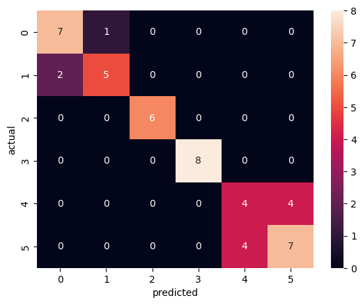

# ⭐ Star Type Classification

## 📌 Short Description

This project classifies stars into six categories—Red Dwarf, Brown Dwarf, White Dwarf, Main Sequence, Super Giants, and Hyper Giants—based on physical properties like temperature, luminosity, radius, absolute magnitude, color, and spectral class. It demonstrates a complete ML workflow including data preprocessing, visualization, model training (Random Forest & SVC), evaluation, and probability calibration.

## 📂 Dataset Details

- **Source:** Kaggle “Star type Classification” dataset  
- **Link:** [Stars.csv](https://www.kaggle.com/datasets/brsdincer/star-type-classification)

Features:

Temperature (K): Surface temperature of the star

L (L/Lo): Luminosity relative to the Sun

R (R/Ro): Radius relative to the Sun

AM (Mv): Absolute Magnitude

Color: General color of the star spectrum

Spectral_Class: Star classification type (O, B, A, F, G, K, M)

Target:

Type (0–5) → Star type
| Type | Star Category |
|------|---------------|
| 0 | Red Dwarf |
| 1 | Brown Dwarf |
| 2 | White Dwarf |
| 3 | Main Sequence |
| 4 | Super Giants |
| 5 | Hyper Giants |

## 🎯 Project Goals

Perform Exploratory Data Analysis (EDA) to visualize patterns and correlations.

Preprocess the dataset: encoding, scaling, and handling features.

Train Machine Learning models (Random Forest & SVC).

Evaluate models using accuracy, confusion matrices, classification reports, and Brier scores for calibration.

Compare models’ predictions and build a reliable star type classifier.

## Tech Stack

Language: Python 3.x

Libraries: pandas, numpy, matplotlib, seaborn, scikit-learn

## 📊 Output & Visualizations

Correlation heatmaps and scatter plots

Hertzsprung–Russell (HR) diagram of star types

Confusion matrices & classification reports for models

Calibration curves and Brier scores for probability prediction accuracy

Random Forest: Achieved high classification accuracy but its probability estimates were slightly overconfident.

SVC with Calibration: Produced more reliable probability predictions with a multi-class Brier score of 0.87, showing good calibration.

Overall Insight: Incorporating probability calibration improves the reliability of model predictions, which is especially useful for multi-class classification tasks like star type prediction.

### HR Diagram of Star Types

### Random Forest Confusion Matrix

### SVC Calibration Curve

## 🚀 Future Work

Hyperparameter tuning using GridSearchCV/RandomizedSearchCV

Experiment with additional models (Logistic Regression, XGBoost, Neural Networks)

Advanced calibration techniques (Platt scaling, Isotonic Regression)

Cross-validation for robust performance evaluation

